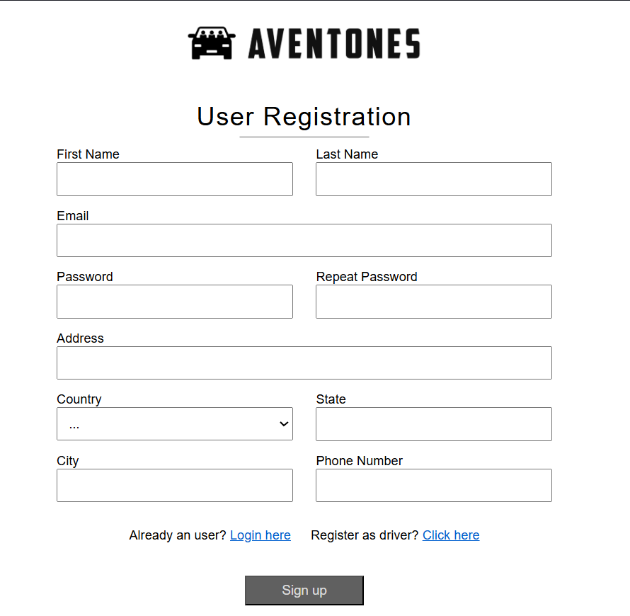
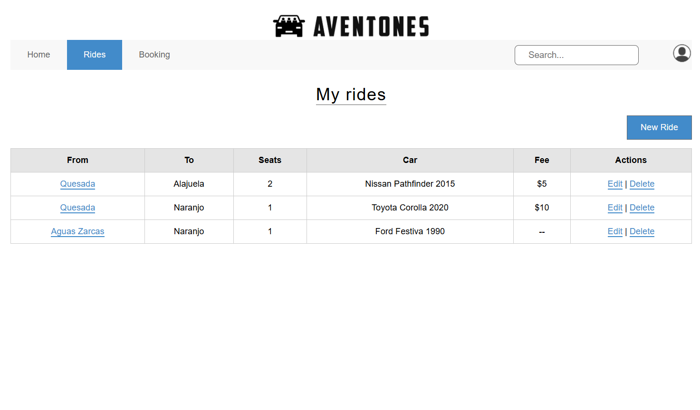
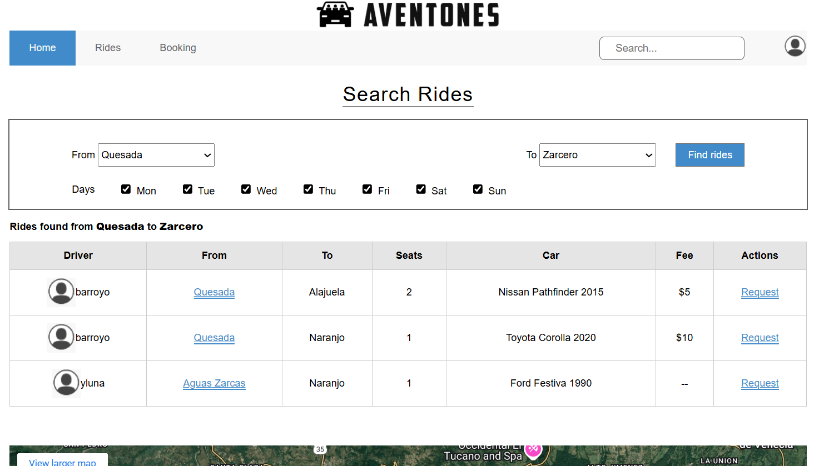

# Aventones - Proyecto Web UTN

Proyecto desarrollado para el curso **Diseño de Aplicaciones Web (ISW-512)** de la carrera **Ingeniería del Software** en la Universidad Técnica Nacional.

## Descripción

**Aventones** es un prototipo funcional de una aplicación web que simula el proceso de registro, autenticación y gestión de viajes compartidos. La aplicación está desarrollada con HTML5, CSS3 y JavaScript, utilizando localStorage para simular la persistencia de datos en el navegador sin necesidad de backend. El desarrollo cumple con los requerimientos funcionales y técnicos solicitados en el curso.

## Tecnologías utilizadas

- HTML5
- CSS3 (sin frameworks)
- JavaScript
- LocalStorage para persistencia simulada
- Git para control de versiones
- Validación con [W3 Validator](https://validator.w3.org/)

## Funcionalidades simuladas

### Usuarios
- Registro de usuario cliente
- Registro de usuario proveedor (incluye datos del vehículo)
- Autenticación con usuario y contraseña
- Inicio de sesión con cuenta Google (simulado)

### Rides (Proveedor)
- Pantalla **My Rides** con listado de rides
- Crear, editar y eliminar rides
- Ver detalles de un ride

### Público general
- Buscar rides entre dos ubicaciones

### Bookings
- Pantalla de rides solicitados y su estado
- Acciones disponibles según el estado del ride

### Configuración
- Editar perfil del usuario

## Estructura del proyecto
Proyecto-1/  
├── index.html  
├── assets/  
│   ├── css/  
│   │   ├── bookings.css  
│   │   └── ...  
│   └── images/  
│       ├── aventones-logo.png  
│       └── ...  
├── pages/  
│   ├── bookings.html  
│   └── ...  
├── js/  
│   ├── login.js  
│   ├── registration.js  
│   └── ...  

## Capturas de Pantalla

### Página de Registro

### My Rides - Gestión de Rides

### Búsqueda Pública de Rides
